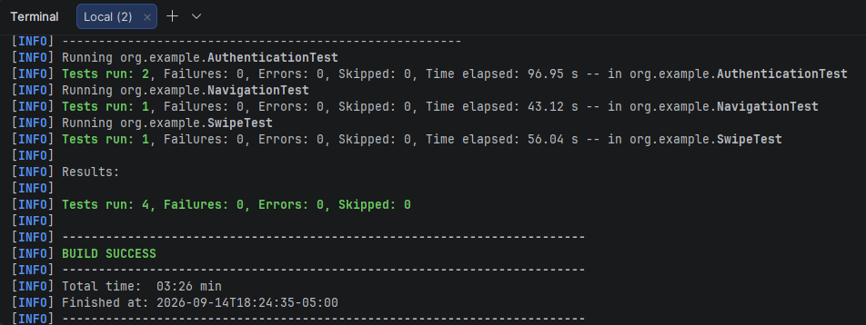

# Android Mobile Automation with Appium

This project automates the WebdriverIO Native Demo App from the practice PDF using
Java, Maven, JUnit 5, Appium Server and the Page Object Model (POM).

## How the tools work together

- **Android Studio** creates and starts an Android Virtual Device (AVD). It is also
  used to install the downloaded `.apk` and verify the application manually.
- **Appium Server** exposes the WebDriver endpoint at `http://127.0.0.1:4723`.
  The Java tests create an `AndroidDriver` session against that endpoint.
- **Appium Inspector** connects to the same server and device, launches the APK,
  and helps inspect accessibility IDs. Those IDs are kept in the page objects,
  not in the test cases.
- **IntelliJ IDEA** imports the Maven project, runs the JUnit tests, and provides
  the test reports.

## Local setup

1. Install Android Studio, create/start an AVD, and confirm it appears in
   `adb devices`.
2. Download the Android APK from
   https://github.com/webdriverio/native-demo-app/releases and install it, or
   provide its path to the tests.
3. Install Appium 2 and the UiAutomator2 driver:
   `npm install -g appium` and `appium driver install uiautomator2`.
4. Start Appium with `appium`.
5. In Appium Inspector, use server URL `http://127.0.0.1:4723`, platform
   `Android`, automation name `UiAutomator2`, the AVD name, and the APK path.

## Running from IntelliJ or Maven

The APK path is intentionally configurable:

```text
mvn test -Dapp.path=C:\path\to\native-demo-app.apk -Ddevice.name="Android Emulator"
```

Optional properties are `appium.url` and `platform.version`. They can also be
provided as environment variables `APP_PATH`, `DEVICE_NAME`, `APPIUM_URL`, and
`PLATFORM_VERSION`. Tests require a running emulator/device and Appium server;
the project compiles independently of them.

## POM structure

- `BaseMobileTest`: creates and closes one isolated driver per test.
- `DriverFactory`: centralizes Android capabilities and environment settings.
- `pages`: contains screen objects and reusable user actions.
- `*Test`: contains only business flows and assertions for the four scenarios.

Each authentication test creates its own random account, so login does not depend
on the signup test execution order.

## Execution evidence

The complete suite passed against the Android emulator:

- 4 tests run
- 0 failures
- 0 errors
- Build success



## Branch and commit flow

The implementation is organized as incremental work:

```text
main
  <- feature/appium-pom
  <- feature/mobile-scenarios
```

Both feature branches are merged into `main`; no feature branch is required to
run the final project.
